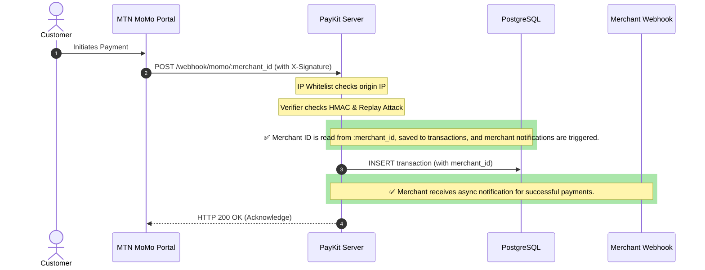

# PayKit — Shipping Readiness & Code Audit Report

This report evaluates the current state of **PayKit** (the MTN MoMo webhook notification engine) and details what is missing or broken before you can confidently launch/ship it to production.

As a student, launching a financial/payment infrastructure product requires a high bar of **reliability**, **security**, and **observability** since actual money and merchant transactions are on the line. Below is a structured analysis of the critical gaps and a concrete roadmap to resolution.

---

## 🔍 Core Architecture & Webhook Flow

The diagram below shows how the current code structure is intended to work, vs. where the core logic breaks:



---

## 🚨 1. Critical Functional Blockers (Must Fix to Work)

These four issues currently prevent the system from functioning or compiling cleanly during tests.

### ✅ Bug A: Webhook handler now reads `:merchant_id`
The current `internal/webhook/handler.go` extracts `merchant_id` from the URL path (`c.Param("merchant_id")`) and stores it on `transaction.MerchantID`, ensuring merchant-scoped persistence and notifications.

---


---

### ✅ Bug B: `Store.Insert` persists `merchant_id`
The current `internal/storage/store.go` `Insert` query includes `merchant_id`, and `internal/webhook/handler.go` sets `transaction.MerchantID` before insertion.

---


### 🟥 Bug C: Retry Logs Failures Stuck in `RETRYING` State
* **File:** [notifier.go](file:///home/brown-moses/go/Go/paykitt/paykit/internal/payments/notifier.go#L68-L72)
* **The Issue:** The loop is declared as `for attempt := 0; attempt < 3; attempt++`. Inside this loop, it checks `if attempt == 3 { deliveryLog.Status = storage.DeliveryStatusFailed }`. However, `attempt` only ranges from `0` to `2`.
* **The Impact:** A failed delivery attempt on the final retry (attempt 2) is incorrectly logged as `RETRYING` instead of `FAILED` in the database. The merchant’s audit logs will show a stuck status instead of showing the notification definitively failed.

#### Proposed Fix:
```diff
-		// Last attempt
-		if attempt == 3 {
-			deliveryLog.Status = storage.DeliveryStatusFailed
-		} else {
-			deliveryLog.Status = storage.DeliveryStatusRetrying
-		}
+		// Last attempt (0-indexed: attempt 2 is the 3rd and final attempt)
+		if attempt == 2 {
+			deliveryLog.Status = storage.DeliveryStatusFailed
+		} else {
+			deliveryLog.Status = storage.DeliveryStatusRetrying
+		}
```
*Also: Remove the duplicate dead-code block on lines 63–66:*
```go
// Remove this duplicate segment
if err == nil {
    slog.Info("notifier: delivered to %s for tx %s", merchant.WebhookURL, transaction.ProviderTxID)
    return
}
```

---

### ✅ Bug D: Static analysis (`go vet`) and `slog` usage
The repository already uses `slog.Info/Warn/Error` with structured key/value pairs, compatible with `go vet`.

---

## 🔒 2. Security Hardening (Essential for Financial APIs)


When launching a payment application, basic security measures are non-negotiable.

### ⚠️ Storing Plaintext API Keys in the Database
* **The Problem:** The `merchants` table stores client API keys (`api_key`) in plaintext. If your database backups or live database instances are compromised, attackers can instantly access every merchant's credentials and download their transaction history or forge webhook configurations.
* **The Solution:** Hash API keys using SHA-256 before saving them to the database.
  1. During registration (`/merchants`), generate the key (e.g. `pk_live_abcd...`), calculate its SHA-256 hash, and save the *hash* to the database. Return the plaintext key *only once* to the user.
  2. During authentication, hash the incoming key from the `Authorization: Bearer <key>` header and look up that hash in the database.

### 🛡️ Rate Limiting & DOS Prevention
* **The Problem:** There is no rate limiting on any endpoint. A bad actor could spam `/merchants` or flood `/webhook/momo/:merchant_id` with fake signatures, overloading the CPU and database.
* **The Solution:** Integrate a rate-limiter middleware like [didip/tollbooth](https://github.com/didip/tollbooth) or write a simple token-bucket middleware using Gin.
* **Student Tip:** If you deploy behind a proxy (like Cloudflare or Nginx), enable rate limiting at the DNS/CDN level for a zero-code solution.

### 🌐 CORS Policy Configuration
* If a merchant builds a frontend dashboard that queries PayKit directly from the browser (e.g., fetching `/transactions`), browsers will block requests due to CORS policies. Add the official [gin-contrib/cors](https://github.com/gin-contrib/cors) middleware to secure acceptable origins.

---

## ⚙️ 3. Operational & Deployment Readiness

### ✅ Non-Idempotent Migrations (Resolved)
* **The Solution:** [migrate.sql](file:///home/brown-moses/go/Go/paykitt/paykit/internal/storage/migrate.sql) has been refactored to use safe `IF NOT EXISTS` constructs, conditional type/enum checks in `DO` blocks, and `ADD COLUMN IF NOT EXISTS`. The `makefile` was also updated to execute with the `-v ON_ERROR_STOP=1` flag to guarantee migration safety and idempotence.

### ✅ Dockerfile / Go Version Mismatches (Resolved)
* **The Solution:** The base image in [Dockerfile](file:///home/brown-moses/go/Go/paykitt/paykit/Dockerfile) has been upgraded from `golang:1.22-alpine` to `golang:1.25-alpine` to match the Go version specified in `go.mod`.

### ✅ Test Coverage (Resolved)
* **The Solution:** Basic unit tests have been successfully created and run for:
  1. **Signature verification** ([verifier_test.go](file:///home/brown-moses/go/Go/paykitt/paykit/internal/auth/verifier_test.go))
  2. **Webhook parsing** ([parser_test.go](file:///home/brown-moses/go/Go/paykitt/paykit/internal/payments/parser_test.go))

### ✅ Dead Letter Queue (DLQ) & Metrics (New Features)
* **The Solution:** A Dead Letter Queue (DLQ) has been implemented via the `delivery_dlq` table, letting operators store, list, and retry permanently failed webhook notifications. Prometheus instrumentation is exposed at `/metrics/prometheus` and merchant-specific transaction volume metrics are exposed at `/metrics` (authenticated).

### 🤖 CI/CD Pipeline Setup
A standard student workflow should automatically check code before deployment. Add a simple `.github/workflows/go.yml` file to run tests:
```yaml
name: Go CI
on: [push, pull_request]
jobs:
  build:
    runs-on: ubuntu-latest
    steps:
    - uses: actions/checkout@v4
    - name: Set up Go
      uses: actions/setup-go@v5
      with:
        go-version: '1.25.0'
    - name: Vet & Build
      run: |
        go vet ./...
        go build ./...
    - name: Test
      run: go test -v ./...
```

---

## 🚀 4. Deployment/Hosting Roadmap (Student-Friendly)

To deploy this online for free or cheap:

1. **Database Hosting:**
   * **Neon.tech:** Offers a generous free tier serverless PostgreSQL. It supports connection pooling out of the box.
   * **Supabase:** Another great Postgres hosting option with free tiers.
2. **Application Hosting:**
   * **Railway.app:** Very easy Docker container deployments (starting at $5/month or using free developer credits).
   * **Render.com:** Offers a free web service tier (containers spin down if idle, but great for student projects).
   * **Fly.io:** Great for deploying Go containers globally close to MTN servers.
3. **Environment Setup (Production):**
   * Keep `DATABASE_URL` stored securely in the hosting provider's dashboard (never hardcoded or committed).
   * Configure `MOMO_WEBHOOK_SECRET` from the MTN Developer portal.
   * Make sure to specify `ALLOWED_IPS` in production to prevent arbitrary clients from sending requests to `/webhook/momo/:merchant_id`.

---

## 📋 Shipping Readiness Checklist

- [x] **Fix Code Issues:** `slog` usage matches `go vet` expectations.
- [x] **Fix Webhook Flow:** `:merchant_id` is extracted in `handler.go` and persisted for merchant-scoped notifications.
- [x] **Fix Retry Logic:** Final retry is correctly marked as `FAILED`.
- [x] **Make File Migrations Idempotent:** Refactor SQL file to run safely multiple times.
- [x] **Upgrade Docker Build Image:** Match Go runtime in Dockerfile (`1.25`).
- [x] **Add Essential Tests:** Validate signature verification to prevent spoofing.
- [x] **Secure API Keys:** Hash keys in DB instead of plaintext storage.
- [ ] **Deploy Database & App:** Hook up a hosted Postgres (e.g. Neon) and deploy Go code to Railway/Render.

